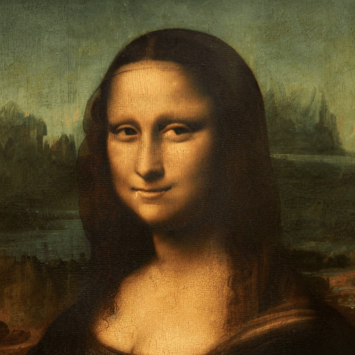

# InstructPix2Pix AnimateDiff Pipeline

This repo has a demo pipeline for using the [`viddle-pix2pix-animatediff`](https://huggingface.co/viddle/viddle-pix2pix-animatediff) motion module. The motion module is designed to be used with InstructPix2Pix and requires a compatable pipeline. 

## Installation

```bash
pip install -r requirements.txt
```

You need to download the `viddle-pix2pix-animatediff-v1.ckpt
` motion module checkpoint from here: https://huggingface.co/viddle/viddle-pix2pix-animatediff/tree/main

By default the `main.py` looks for the checkpoint `checkpoints` directory, so place it there or you will need to pass the `--motion_module` argument to the script.

## Usage

To generate an example pass in either a `init_image` path or `init_folder` path. The `init_folder` path should contain a series of images, one for each frame of type `*.png` or `*.jpg`, that will be used to generate the animation. The `init_image` path should be a single image that will be used to generate the animation. 

```bash
$ python main.py --init_image "images/mona-lisa.jpg" --prompt "make her smile"
```

This should create a gif and mp4 in the `output` directory.




You can also use the model to stylize video. 

```bash
python main.py --init_folder "PATH_TO_VIDEO_FRAMES" \
  --prompt "In the style of a charcoal sketch" \
  --height 1024 \
  --width 576 
```

Produces:


For best results use `--dtype="float32"`, `--num_inference_steps=100` and the highest resolution you can afford.

To see all the options run:

```bash
$ python main.py --help
options:
...
  ```

